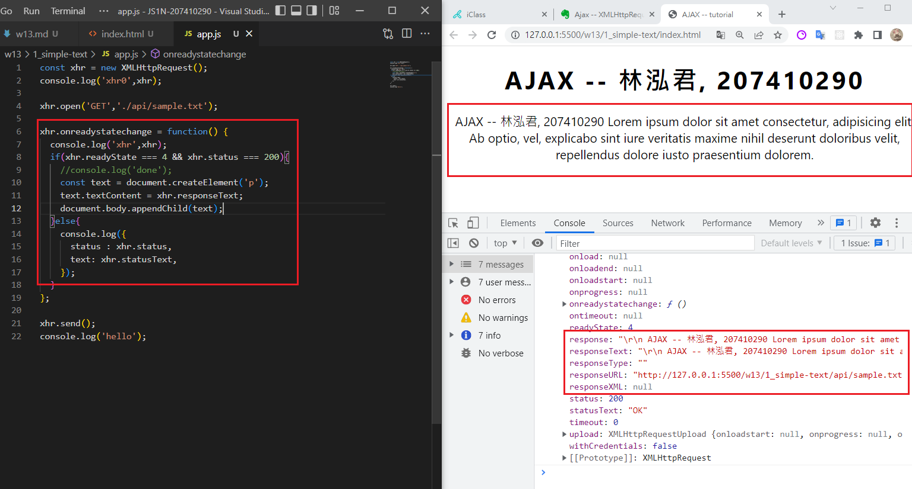
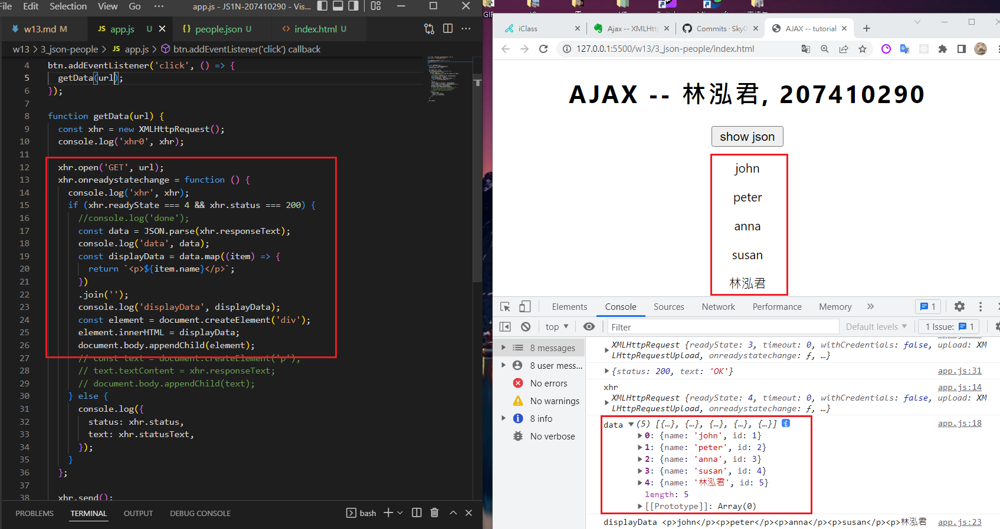

### LAST log on "2022-05-11"


```
$ git log --pretty=format:"%h%x09%an%x09%ad%x09%s" --after="2022-5-17"


```

### w13-p1: use xhr object to get sample.txt, and show it on webpage



### w13-p2: use xhr object to get people.json, and show it on webpage

