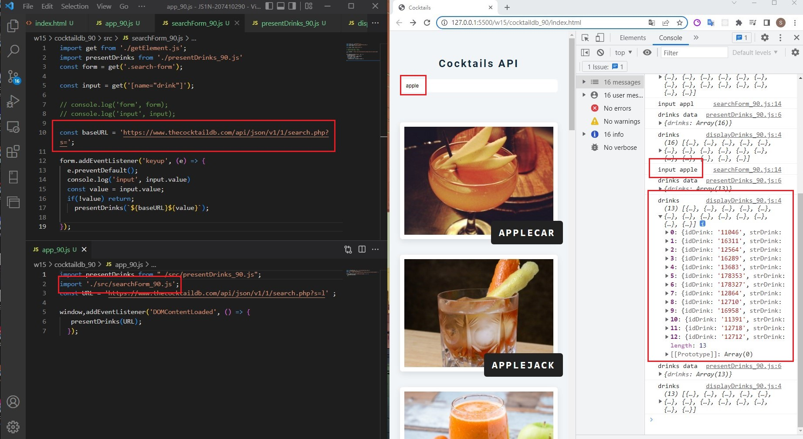
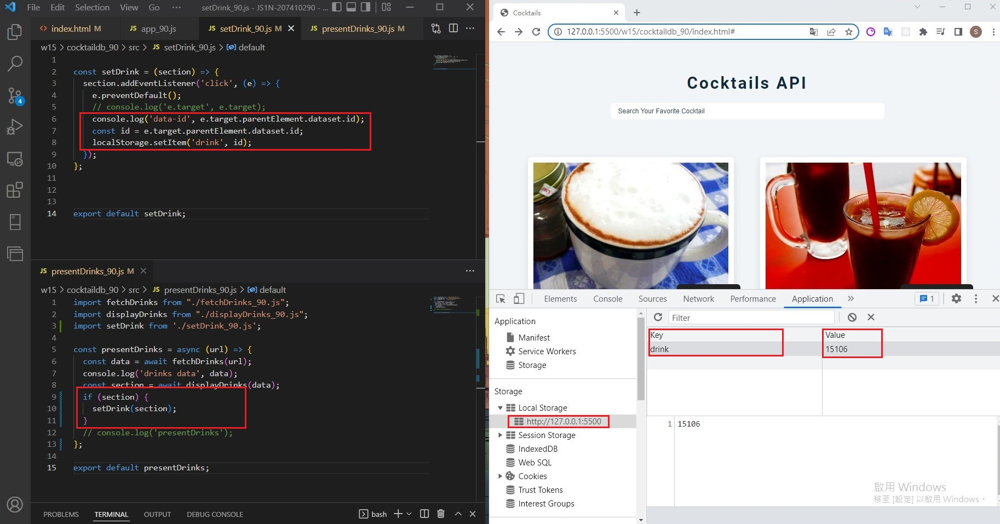

### LAST log on "2022-05-25"


```
$ git log --pretty=format:"%h%x09%an%x09%ad%x09%s" --after="2022-5-24"
b3259f6 Sky00l  Fri Jun 3 21:32:41 2022 +0800   ### w14-p5-1: let loading.gif show first, remove loading.gif if no drinks matched/### w14-p5-2: let loading.gif show first, 
remove loading.gif in order to show all drinks
bbe81f5 Sky00l  Fri Jun 3 21:02:38 2022 +0800   ### w14-p4: fetch drinks from given url, and display all drinks
05993d7 Sky00l  Fri Jun 3 19:07:28 2022 +0800   ### w14-p3: fetch drinks, get null, show no drinks matched
3ced365 Sky00l  Fri Jun 3 17:31:57 2022 +0800   ### w14-p2: fetch data from given url 
f65d5b8 Sky00l  Fri Jun 3 16:15:58 2022 +0800   ### w14-p1: use create html themne for Cocktail API demo
```

### w15-p1: finish search form



### w15-p2: Get data-id of a drink, save to local storage



### w14-p3: fetch drinks, get null, show no drinks matched


### w14-p4: fetch drinks from given url, and display all drinks


### w14-p5-1: let loading.gif show first, remove loading.gif if no drinks matched


### w14-p5-2: let loading.gif show first, remove loading.gif in order to show all drinks

